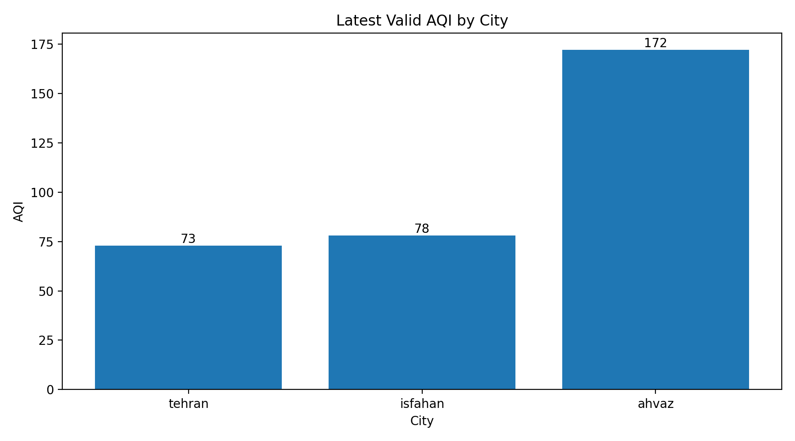
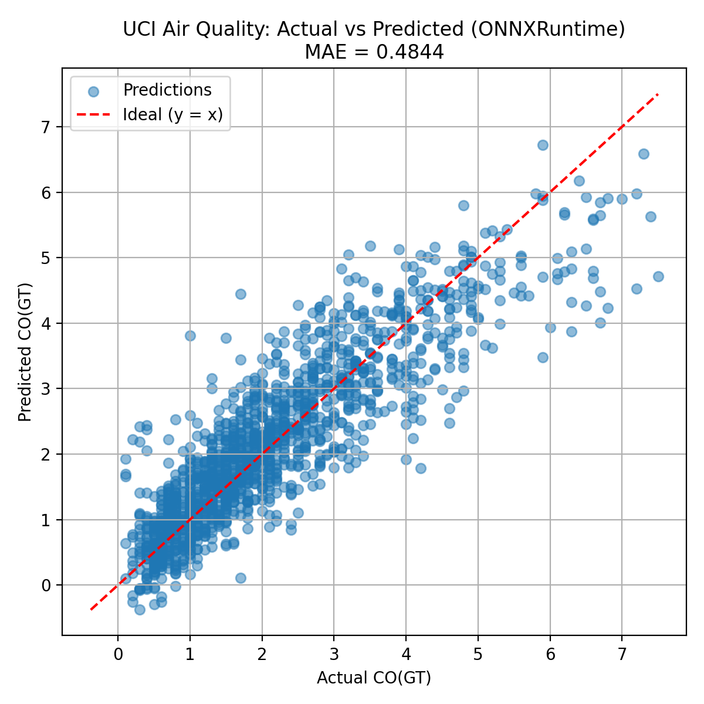
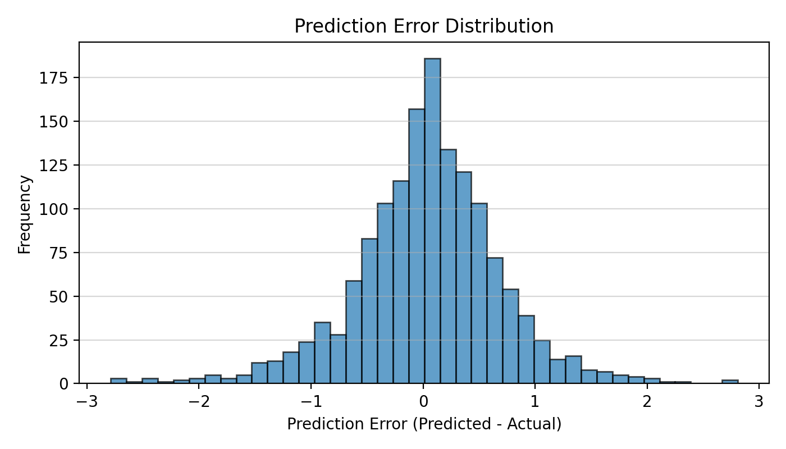

# Air Quality Prediction Pipeline

A modular and extensible air quality prediction pipeline designed for offline and online data sources, with a strong focus on clean architecture, reproducibility, and real-world data challenges.

This project was developed as an academic machine learning project, with the **UCI Air Quality dataset as the core data source** and an **optional real-time AQICN data pipeline** implemented as a bonus extension.

---

## Project Overview

Air quality prediction is a real-world data science problem that involves noisy data, missing values, external dependencies, and reproducibility challenges.

The goal of this project is to design and implement a **robust, modular pipeline** that:

- Supports multiple data sources
- Separates data ingestion, modeling, and visualization
- Handles external API failures gracefully
- Produces reproducible and interpretable outputs

The project is intentionally designed with **two execution modes**:

- **UCI mode (core)** – fully offline, reproducible, and model-centric
- **AQICN mode (bonus)** – optional real-time data collection from an external API

---

## Core Idea

The key contribution of this project is **architecture**, not just modeling.

Instead of building a single-script solution, the pipeline is structured to resemble a real-world data system:

- Mode-based execution
- Optional external dependencies
- Persistent storage
- Clear separation of concerns
- Fault-tolerant design

The real-time AQICN integration was implemented as an **optional bonus feature**, independent of the project requirements.

---

## Project Structure

```
src/
│
├── ml/
│   ├── train_aqicn_model.py
│   ├── train_uci_model.py
│   ├── pipeline/
│   │   ├── __init__.py
│   │   ├── aqicn_runner.py
│   │   ├── collector.py
│   │   └── uci_runner.py
│   ├── storage/
│   │   ├── __init__.py
│   │   └── sqlite_storage.py
│   ├── tests/
│   │   └── test_aqicn_token.py
│   ├── visualization/
│   │   ├── __init__.py
│   │   ├── plots.py
│   │   └── uci_plots.py
│   ├── config/
│   │   └── settings.py
│   ├── data_loader/
│   │   ├── __init__.py
│   │   ├── aqi_api_client.py
│   │   └── uci_loader.py
│   └── __init__.py
│
├── data/
│   ├── models/
│   │   └── uci_co_model.onnx
│   ├── plots/
│   │   ├── latest_aqi.png
│   │   ├── uci_actual_vs_pred.png
│   │   └── uci_prediction_error_hist.png
│   └── uci/
│       └── aqi_history.sqlite
│
├── .env
├── .gitignore
├── LICENSE
├── README.md
└── requirements.txt

```

---

## Execution Modes

### 1. UCI Mode (Core)

This is the **primary and fully reproducible mode** of the project.

- Dataset: UCI Air Quality Dataset
- Type: Offline
- Goal: Train a regression model to predict air quality indicators
- Output: Predictions, error analysis, and visualizations

Run:

```bash
python -m src.main --mode uci
```

---

### 2. AQICN Mode (Bonus)

This mode implements a **real-time data collection pipeline** using the AQICN API.

- Dataset: AQICN (external, online)
- Type: Optional / bonus
- Goal: Collect and store live AQI data for selected cities
- Storage: SQLite database

Run:

```bash
python -m src.main --mode aqicn
```

> **Note:**
> AQICN is an external data provider. API authentication and availability depend entirely on the service itself.
> The pipeline is designed to handle invalid keys, rate limits, or downtime gracefully without affecting the core project.

---

## Outputs & Visualizations

All generated plots are saved under `data/plots/`.

### Latest AQI Snapshot (AQICN)

Displays the most recent AQI values collected for available cities.



---

### UCI: Actual vs Predicted Values

Compares true values against model predictions on the UCI dataset.



---

### UCI: Prediction Error Distribution

Histogram of prediction errors to analyze model performance.



---

## Libraries & Tools Used

- Python 3.10+
- NumPy
- Pandas
- Scikit-learn
- Matplotlib
- SQLite
- ONNX
- python-dotenv
- argparse
- logging

---

## Design Highlights

- Modular, mode-based execution
- Clean separation of data, modeling, and visualization
- Centralized configuration management
- Persistent storage for online data
- Robust logging and error handling
- Reproducible offline experiments

---

## Limitations & Ongoing Work

- Real-time AQICN data availability depends on external API access
- API keys may become invalid or rate-limited
- Online data is intentionally optional and non-blocking

This project is **actively designed for extension**.

---

## Future Work

- Stable real-time AQI forecasting using live data
- Offline AQICN-compatible dataset snapshots
- Time-series modeling (LSTM / Temporal CNN)
- Advanced error analysis and explainability
- Support for additional cities and data sources

> I would be happy to receive your application if you have a suitable dataset or a new idea for developing and improving the project.

---

## Academic Note

The AQICN pipeline was implemented as an **independent bonus extension** and was not part of the original project requirements.

The primary focus of this project is **architecture, modeling, and reproducibility**, not dependency on third-party services.

---
